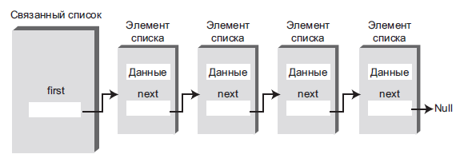

# Строение связанного списка
В связанном списке каждый элемент данных встраивается в специальный объект, называемый элементом списка (классу, на основе которого создаются такие объекты, часто присваивается имя Link). Так как список содержит много однотипных
элементов, для них удобно создать отдельный класс, отличный от класса самого
связанного списка. Каждый элемент (то есть объект Link) содержит ссылку на следующий элемент списка; поле, в котором эта ссылка хранится, обычно называется
next. Объект списка содержит ссылку на первый элемент first.

# Отношения вместо конкретных позиций
В массиве каждый элемент всегда занимает конкретную позицию и к нему
можно обратиться напрямую по индексу. Все происходит, как при поиске дома на
незнакомой улице: нужный дом легко находится по адресу.
В списке конкретный элемент можно найти только одним способом: отследив
его по цепочке элементов от начала списка. Обратиться к элементу данных напрямую невозможно, для поиска
приходится использовать отношения между элементами. Вы начинаете с первого
элемента, переходите ко второму, потом к третьему — пока не найдете тот, который
вам нужен.

# Эффективность связанных списков
Вставка и удаление в начале связанного списка выполняются очень быстро. Операция сводится к изменению одной или двух ссылок, выполняемому за время O(1).
Поиск, удаление и вставка рядом с конкретным элементом требует перебора
в среднем половины элементов списка, для которого необходимо O(N) сравнений.
У массива эти операции тоже выполняются за время O(N), но связанный список все
равно работает быстрее, потому что он не требует перемещения элементов при вставке или удалении. Повышение эффективности может быть весьма значительным,
особенно если копирование занимает существенно больше времени, чем сравнение.
Другое важное преимущество связанных списков перед массивами заключается в том, что связанный список всегда использует ровно столько памяти, сколько
необходимо, и может расширяться вплоть до всей доступной памяти. Фиксация
размера массива при создании обычно приводит либо к неэффективному исполь-
зованию памяти (если массив слишком велик) или исчерпанию всей доступной
памяти (если массив слишком мал). Векторы (динамически расширяемые массивы) до определенной степени решают эту проблему, но они обычно расширяются
с фиксированным приращением, например размер массива удваивается перед
переполнением. Впрочем, даже это решение не так эффективно использует память,
как связанный список.